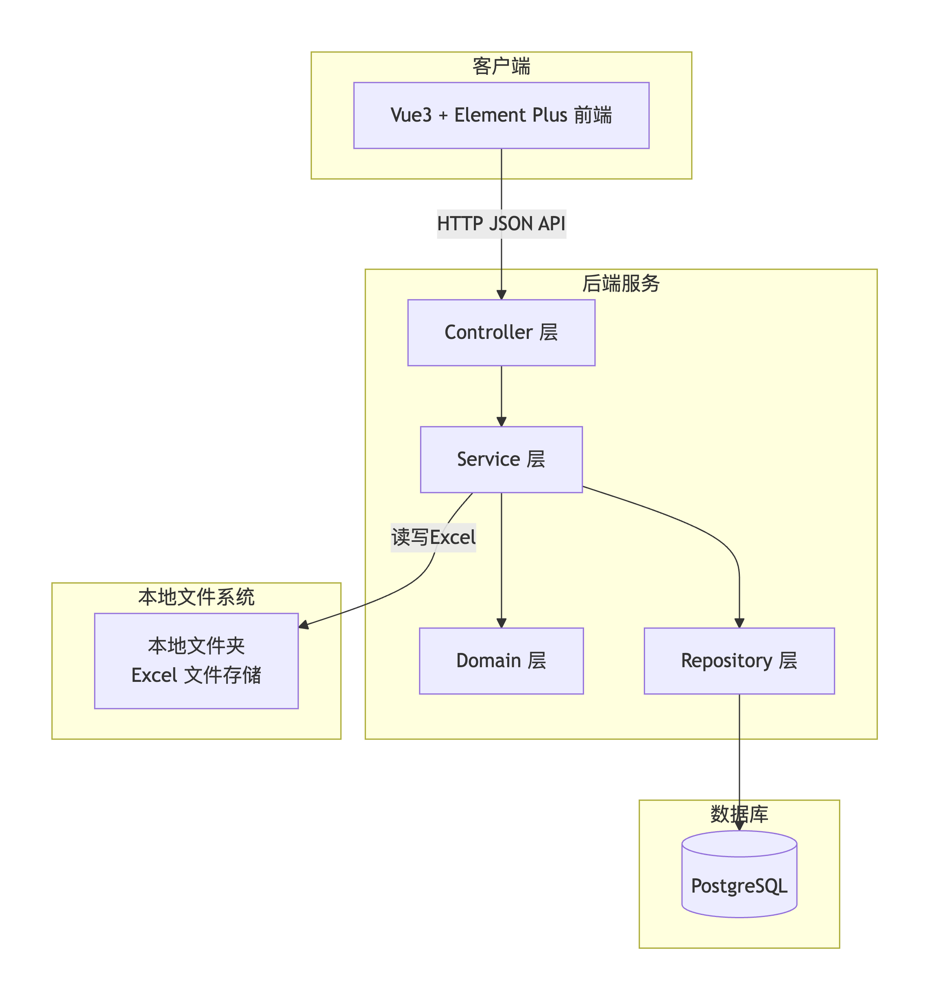

# 总体架构

## 架构概览

- 前端：Vue 3 + Element Plus + Vite
- 后端：Spring Boot 2.x + MyBatis-Plus
- 数据库：PostgreSQL
- 文件处理：EasyExcel（本地读写）

## 架构图

## 关键设计原则

- 严格分层，职责单一
    遵循《Java开发规范》第4.3节分层要求：
    Controller 层：仅负责请求参数校验（使用 Bean Validation）、响应封装、权限注解。不编写业务逻辑，不直接操作数据库。
    Service 层：编排业务用例，管理事务边界，协调多个 Repository 或 Domain Service。方法命名体现业务动作（如 generateCode、batchValidate）。
    Domain 层：封装核心业务规则（编码生成算法、校验规则、统计逻辑）。领域对象应表达业务语义，避免贫血模型。
    Repository 层：使用 MyBatis-Plus 或 JPA 操作 PostgreSQL。返回结果转换为领域对象或 DTO，不向上暴露 SQL 细节。

- DTO 与实体分离，禁止混用
    请求/响应 DTO：独立定义于 controller/dto 包，使用 Lombok + Bean Validation 注解。
    领域对象：定义于 domain/model 包，包含业务行为和状态校验。
    持久化对象：定义于 repository/entity 包，与数据库表一一对应。
    转换：使用 MapStruct 或手工转换，避免对象交叉污染。

- 统一异常处理与错误码
    定义 BusinessException 和 SystemException，携带稳定错误码（如 CODE_GENERATE_FAILED、VALIDATION_ERROR）。
    全局 @RestControllerAdvice 统一处理异常，返回标准 ErrorResponse（包含 code、message、requestId）。
    错误码按模块分段（如 10xxx 编码生成模块，20xxx 校验模块），并在 ErrorCode 常量类中集中管理。

- 严格遵循数据库规范
    所有业务表必须包含：id（雪花 ID）、tenant_id、creator、modifier、create_tm、modify_tm、if_delete。
    表名、字段名使用小写下划线命名，必须添加注释。
    采用逻辑删除（if_delete=1 表示已删除），物理删除仅限临时表或特殊场景。
    为高频查询字段（如 code、tenant_id、create_tm）建立索引，组合索引按过滤性排序。
    金额、精度敏感字段使用 DECIMAL，禁止 FLOAT/DOUBLE。
    利用 PostgreSQL 特性：全文检索使用 tsvector/tsquery（配合 pg_jieba 中文分词），向量检索使用pgvector，空间查询使用 PostGIS。

- 安全与参数校验
    前端：使用 Zod 校验表单输入（如编码筛选条件、上传 Excel 格式）。
    后端：Controller 层使用 @Valid 校验 DTO；Service 层对关键业务参数再次校验。
    防 SQL 注入：使用 MyBatis 参数化查询（#{}），禁止字符串拼接 SQL。
    敏感信息：不打印密码、Token、密钥；日志中脱敏用户手机号、邮箱。

- 性能与可扩展性
    编码生成接口响应 <2 秒：数据库字典表建立索引，使用缓存（Caffeine）加载字典数据。
    批量校验 Excel 支持至少 1000 行：使用 EasyExcel 流式读取，分批处理。
    分页查询编码记录使用 pageNum/pageSize，限制最大 pageSize=100。
    后续可扩展：将编码规则配置化（存入数据库），支持动态规则调整。

- 文档与 AI 友好
    根目录提供 README.md 说明项目启动、环境配置、API 文档入口。
    每个主要模块（controller、service、domain）提供独立 package-info.java 或 README.md 说明职责。
    API 文档使用 Swagger/OpenAPI 3.0，自动生成且与代码同步。
