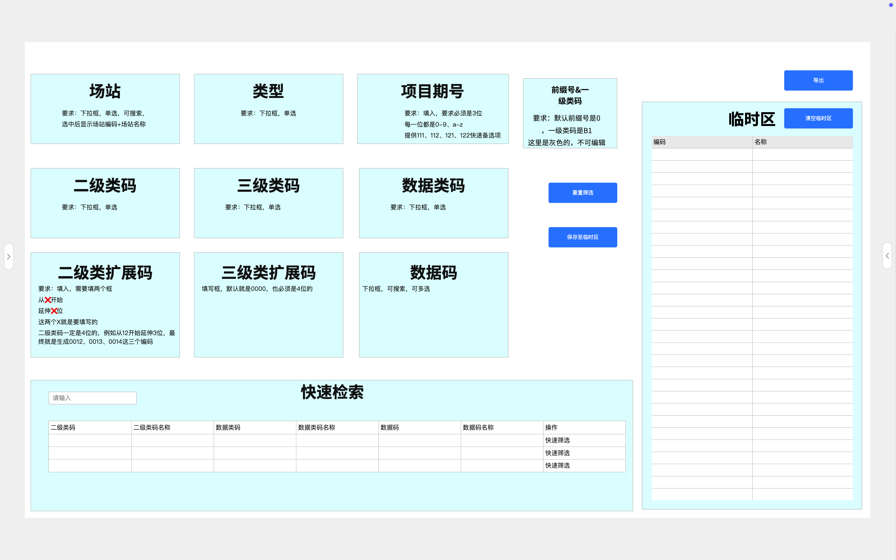

# 编码生成

## 功能目标

- 提供11段编码维度的字典筛选条件（场站、类型、项目期号&并网线路、前缀号、各级类码、数据类码/数据码），支持用户逐级选择，自动加载关联数据
- 根据用户选定的条件组合，自动生成合规的测点编码及编码名称
- 支持单条/多条编码的临时保存、批量汇总、复制、导出Excel
- 支持编码生成记录的持久化保存与历史追溯查询

## 页面说明

### 页面布局

编码生成页面采用上下布局结构：

- **顶部区域**：筛选条件面板，按行排列11段编码维度的筛选条件，每行放置3-4个条件项
- **中部区域**：操作按钮行（生成编码、清空条件、保存至临时区、批量导出）
- **底部区域**：编码结果展示区，包含"本次生成"和"临时区"两个标签页
参考:

### 页面路径

- `/code-generate` — 编码生成主页面

### 页面元素

#### 筛选条件面板

| 条件名称 | 位数 | 控件类型 | 数据来源 | 说明 |
|---------|------|---------|---------|------|
| 场站 | 4位 | 下拉选择 | cec_new_energy_station_dict | 必选，单选 |
| 类型 | 2位 | 下拉选择 | cec_new_energy_type_dict | 必选，单选 |
| 项目期号&并网线路 | 3位 | 下拉选择 | 字典表 | 必选，单选 |
| 前缀号 | 1位 | 下拉选择 | cec_new_energy_prefix_dict | 必选，单选 |
| 一级类码 | 2位 | 下拉选择 | cec_new_energy_code_dict | 必选，单选 |
| 二级类码 | 3位 | 下拉选择 | 联动一级类码 | 必选，单选 |
| 二级类扩展码 | 4位 | 下拉选择 | 联动二级类码 | 必选，单选 |
| 三级类码 | 3位 | 下拉选择 | 联动二级类扩展码 | 必选，单选 |
| 三级类扩展码 | 4位 | 下拉选择 | 联动三级类码 | 必选，单选 |
| 数据类码 | 2位 | 下拉选择 | 字典表 | 可选，单选 |
| 数据码 | 3位 | 下拉选择/文本输入 | 联动数据类码 | 可选 |

筛选条件采用逐级联动模式，上级选择影响下级可选范围。10项必选条件全部选定后方可点击"生成编码"。

#### 操作按钮

| 按钮名称 | 触发动作 | 前置条件 |
|---------|---------|---------|
| 生成编码 | 根据已选条件生成编码 | 所有必选条件已选择 |
| 清空条件 | 重置所有筛选条件至未选状态 | 无 |
| 保存至临时区 | 将本次生成的编码列表保存至临时区 | 存在已生成的编码 |
| 批量导出 | 将临时区中的编码导出为Excel文件 | 临时区存在数据 |

#### 编码结果展示区

**本次生成标签页**：展示最近一次生成的编码列表，包含字段：序号、编码、编码名称、生成时间、操作（复制单条）

**临时区标签页**：展示所有已临时保存的编码汇总列表，支持多选，包含字段：复选框、序号、编码、编码名称、生成时间、批次。底部显示总条数，操作按钮包括：复制选中、删除选中、导出Excel。

## 接口说明

| 接口名称 | 方法 | 路径 | 说明 |
|---------|------|------|------|
| 获取字典数据 | GET | /api/dict/{dictType} | 获取指定类型的字典数据 |
| 获取联动字典项 | GET | /api/dict/{dictType}/items?parentCode={code} | 获取指定上级编码下的字典项 |
| 生成编码 | POST | /api/codes/generate | 根据筛选条件生成编码 |
| 保存至临时区 | POST | /api/codes/draft | 将编码保存至临时区 |
| 查询临时区列表 | GET | /api/codes/draft | 分页查询临时区编码列表 |
| 删除临时区记录 | DELETE | /api/codes/draft/{id} | 删除指定临时区记录 |
| 批量删除临时区 | DELETE | /api/codes/draft/batch | 批量删除临时区记录 |
| 查询生成历史 | GET | /api/codes | 分页查询已保存的编码生成记录 |
| 导出Excel | GET | /api/codes/export | 导出临时区编码为Excel文件 |

## 输入输出

### 生成编码

**输入：**

```json
{
  "stationCode": "string",           // 场站编码（4位，必填）
  "typeCode": "string",              // 类型编码（2位，必填）
  "projectLineCode": "string",       // 项目期号&并网线路编码（3位，必填）
  "prefixNo": "string",              // 前缀号（1位，必填）
  "firstClassCode": "string",        // 一级类码（2位，必填）
  "secondClassCode": "string",       // 二级类码（3位，必填）
  "secondExtCode": "string",         // 二级类扩展码（4位，必填）
  "thirdClassCode": "string",        // 三级类码（3位，必填）
  "thirdExtCode": "string",          // 三级类扩展码（4位，必填）
  "dataTypeCode": "string",          // 数据类码（2位，可选）
  "dataCode": "string"               // 数据码（3位，可选）
}
```

**输出：**

```json
{
  "code": "string",       // 生成的测点编码
  "name": "string",       // 生成的编码名称
  "generateTime": "2025-01-01 12:00:00"  // 生成时间
}
```

### 保存至临时区

**输入：**

```json
{
  "codes": [
    {
      "code": "string",
      "name": "string"
    }
  ]
}
```

**输出：**

```json
{
  "savedCount": 10,       // 成功保存条数
  "totalCount": 15        // 临时区总条数
}
```

### 查询临时区列表

**输入参数：** pageNum, pageSize

**输出：**

```json
{
  "list": [
    {
      "id": 1,
      "code": "string",
      "name": "string",
      "batchNo": "string",
      "generateTime": "2025-01-01 12:00:00"
    }
  ],
  "total": 50,
  "pageNum": 1,
  "pageSize": 20
}
```

## 业务规则

### 编码规则

- 测点编码由 11 段编码维度拼接而成，共31位
- 编码格式：`{场站编码(4位)}{类型(2位)}{项目期号&并网线路(3位)}{前缀号(1位)}{一级类码(2位)}{二级类码(3位)}{二级类扩展码(4位)}{三级类码(3位)}{三级类扩展码(4位)}{数据类码(2位)}{数据码(3位)}`
- 编码总长度固定为31位，每段按字典标准长度取值，不足补零
- 编码名称由各段字典项名称拼接生成，格式：`{场站名称}-{类型名称}-{项目期号名称}-...-{数据码名称}`

### 条件筛选规则

- 10 项必选条件必须全部选择（场站、类型、项目期号&并网线路、前缀号、一级类码、二级类码、二级类扩展码、三级类码、三级类扩展码），否则"生成编码"按钮置灰不可点击
- 条件采用逐级联动：选择上级分类后，下级分类下拉框自动加载对应数据
- 非必选条件（数据类码、数据码）未选择时，编码对应段使用默认值"000"填充
- 切换已选条件时，已生成的编码结果自动清空，需重新生成
- 下拉选择框支持关键字搜索过滤（当字典项超过50条时显示搜索框）

### 临时区规则

- 每次"保存至临时区"操作生成一个批次号，格式：`YYYYMMDDHHmmss`
- 临时区数据按批次分组展示，同一批次的编码归组显示
- 临时区支持多批次累积保存，不自动清理
- 单次生成最多100条编码，超过时提示"单次生成数量超出限制"
- 临时区总上限为5000条，超出时提示"临时区已满，请先导出或清理"
- 临时区数据仅保存在前端状态中（刷新页面后丢失），如需持久化保存需调用保存接口

### 导出规则

- 导出文件格式：`.xlsx`
- 导出字段：序号、编码、编码名称、批次号、生成时间
- 文件命名规则：`测点编码_导出时间.xlsx`
- 单次导出最大行数：10000行，超出时提示分批导出

## 数据关联

| 关联表 | 关联关系 | 用途 |
|-------|---------|------|
| cec_new_energy_station_dict | 场站字典 | 加载场站下拉选项（4位编码） |
| cec_new_energy_type_dict | 类型字典 | 加载类型下拉选项（2位编码） |
| cec_new_energy_prefix_dict | 编码前缀字典 | 加载前缀号下拉选项（1位编码） |
| cec_new_energy_code_dict | 标准编码字典 | 加载各级类码选项（一级→二级→二级扩展→三级→三级扩展联动） |
| cec_new_energy_project_line_dict | 项目期号&并网线路字典 | 加载项目期号&并网线路下拉选项（3位编码） |
| cec_new_energy_data_type_dict | 数据类字典 | 加载数据类码下拉选项（2位编码） |
| cec_new_energy_createcode | 生成编码记录表 | 保存/查询编码生成记录 |
| cec_new_energy_checkdata | 编码稽核数据表 | 后续校验环节引用 |

## 异常处理

| 异常场景 | 前端提示 | 处理方式 |
|---------|---------|---------|
| 字典数据加载失败 | "筛选条件加载失败，请刷新重试" | 禁用生成按钮，显示重试按钮，记录错误日志 |
| 必选条件未选全 | "请完成所有必选条件后再生成编码" | 生成按钮置灰，高亮未选条件项 |
| 条件组合无匹配编码 | "未生成有效编码，请检查筛选条件是否完整合规" | 清空结果区域，保持条件不变 |
| 临时区已满 | "临时区已满（上限5000条），请先导出或清理" | 阻止保存操作 |
| 单次生成超限 | "单次生成数量超出限制（上限100条）" | 阻止生成操作 |
| 导出失败 | "导出失败，请检查权限或重试" | 保留当前编码列表，支持重新导出 |
| 复制失败 | "复制失败，请手动选择复制" | 提示浏览器兼容性问题 |
| 网络异常 | "网络连接异常，请检查网络后重试" | 显示错误提示，保留页面状态 |

## 验收标准

1. 进入编码生成页面，11段编码维度的筛选条件正确加载显示
2. 条件逐级联动正常（一级类码→二级类码→二级类扩展码→三级类码→三级类扩展码），上级切换下级联动更新
3. 10项必选条件未选全时生成按钮置灰
4. 全部必选条件选定后点击生成，生成的编码为31位，格式与各段位数一致
5. 切换任意条件，已有生成结果自动清空
6. 点击"保存至临时区"，编码成功保存至临时区标签页
7. 临时区按批次分组展示，显示总条数
8. 多批次保存后临时区汇总正确
9. 临时区复制选中编码到剪贴板功能正常
10. 临时区删除选中记录功能正常
11. 导出Excel文件内容正确、格式规范
12. 字典项超过20条时显示搜索过滤功能
13. 异常场景下正确显示友好提示

## 页面联动说明

1.二级类码和三级类码做关联，先选择二级类码，然后才可选二级类码下对应的三级类码
2.二级类码和数据类码、数据码做关联。先选择二级类码，然后才过滤二级类码下的数据类码和数据码
3.选择二级类码和数据类码后，过滤出对应的数据码可选。


