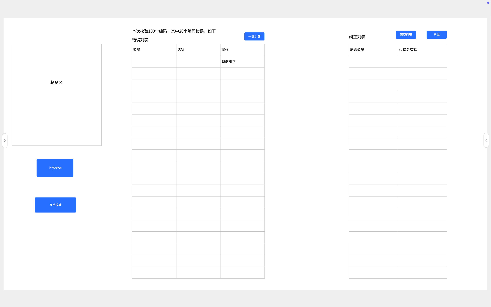

# 编码校验

## 功能目标

- 支持手动录入、批量粘贴、上传Excel三种编码输入方式
- 根据编码字典规则自动校验编码合规性，标记合规/异常
- 对异常编码提供智能纠错建议（基于编辑距离匹配字典项）
- 支持单条编码逐个纠错和一键批量纠错
- 展示纠错后的纠正结果列表，支持导出校验结果

## 页面说明

### 页面布局

编码校验页面采用左右双栏布局结构：

- **左侧面板（输入区）**：输入方式切换、编码输入区域、开始校验按钮
- **右侧面板（结果区）**：校验结果与纠正列表的标签页切换
参考：

### 页面路径

- `/code-validate` — 编码校验主页面

### 页面元素

#### 左侧面板 — 编码输入区

**输入方式切换（Tab切换）：**

| 方式名称 | 说明 |
|---------|------|
| 手动录入 | 单条输入编码，逐条添加至待校验列表 |
| 批量粘贴 | 文本框批量粘贴编码列表，每行一条 |
| 上传Excel | 上传 .xlsx/.xls 文件导入编码列表 |

**手动录入模式：**
- 单行输入框 + "添加"按钮，添加后编码进入待校验列表
- 待校验列表展示已添加的编码，支持逐条删除

**批量粘贴模式：**
- 多行文本框，每行一条编码
- 示例提示："请粘贴编码列表，每行一条"
- 显示已输入编码条数（动态计数）

**上传Excel模式：**
- 文件拖拽/点击上传区域
- 支持文件类型：.xlsx, .xls
- 文件大小限制：10MB
- 上传后展示文件名称、导入条数
- 提供标准模板下载按钮

**操作按钮：**

| 按钮 | 触发动作 | 前置条件 |
|-----|---------|---------|
| 开始校验 | 对已输入的编码列表执行校验 | 编码列表不为空 |
| 清空列表 | 清空所有待校验编码 | 编码列表不为空 |

#### 右侧面板 — 校验结果区

**Tab1 — 校验结果：**

展示校验完成后的结果列表，表格字段如下：

| 字段 | 说明 |
|-----|------|
| 序号 | 行号 |
| 原始编码 | 用户输入的待校验编码 |
| 编码名称 | 编码对应的名称（合规编码显示名称，异常编码显示"-"） |
| 校验结果 | 合规（绿色标签）/ 异常（红色标签） |
| 纠错建议 | 异常编码的建议正确编码及名称 |
| 操作 | 异常编码行显示"智能纠错"按钮，点击进入单条纠错 |

页面顶部操作按钮：
- **一键纠错**：对所有异常编码执行批量纠错，将纠错结果加入纠正列表
- **导出**：导出校验结果为Excel文件

**Tab2 — 纠正列表：**

展示纠错完成后的结果列表，表格字段如下：

| 字段 | 说明 |
|-----|------|
| 序号 | 行号 |
| 原始编码 | 纠错前的原始编码 |
| 原始名称 | 纠错前的原始编码名称 |
| 纠正后编码 | 纠错后的正确编码 |
| 纠正后名称 | 纠错后的正确编码名称 |
| 状态 | 待确认 / 已确认 |
| 操作 | 确认、编辑、删除 |

### 交互说明

1. 切换输入方式时，已输入的编码列表保留，但当前激活的输入区域切换显示
2. 校验过程中显示加载状态或进度条
3. 校验完成后自动切换至"校验结果"Tab，展示结果数据
4. 点击单条"智能纠错"弹出纠错确认对话框，展示原编码、建议编码、建议原因，用户确认后更新
5. 点击"一键纠错"直接对所有异常编码应用纠错建议，结果加入纠正列表
6. 纠正列表中的记录支持逐条确认、编辑修改、删除

## 接口说明

| 接口名称 | 方法 | 路径 | 说明 |
|---------|------|------|------|
| 单条编码校验 | POST | /api/validate/single | 校验单条编码的合规性 |
| 批量文本校验 | POST | /api/validate/batch | 批量校验文本输入的编码 |
| Excel上传校验 | POST | /api/validate/upload | 上传Excel文件进行批量校验 |
| 获取校验任务状态 | GET | /api/validate/tasks/{taskId} | 获取异步校验任务状态 |
| 获取校验结果 | GET | /api/validate/results/{taskId} | 获取校验结果详情 |
| 获取纠错建议 | GET | /api/validate/suggestions/{code} | 获取异常编码的纠错建议（编辑距离匹配） |
| 一键纠错 | POST | /api/validate/batch-correct | 对指定异常编码列表执行批量纠错 |
| 确认纠正结果 | PUT | /api/validate/corrections/{id}/confirm | 确认单条纠正结果 |
| 导出校验结果 | GET | /api/validate/results/{taskId}/export | 导出校验结果为Excel文件 |
| 下载导入模板 | GET | /api/validate/template/download | 下载标准Excel导入模板 |

## 输入输出

### 批量文本校验

**输入：**

```json
{
  "codes": [
    {
      "code": "string",      // 待校验编码
      "name": "string"       // 待校验编码名称（可选）
    }
  ]
}
```

**输出：**

```json
{
  "taskId": "string",          // 校验任务ID（用于异步查询）
  "totalCount": 100,           // 总校验条数
  "status": "PROCESSING"       // 任务状态：PROCESSING / COMPLETED / FAILED
}
```

### 获取校验结果

**输出：**

```json
{
  "taskId": "string",
  "totalCount": 100,
  "compliantCount": 80,
  "abnormalCount": 20,
  "details": [
    {
      "index": 1,
      "originalCode": "string",
      "originalName": "string",
      "result": "COMPLIANT",          // COMPLIANT / ABNORMAL
      "suggestedCode": "string",      // 异常时有值
      "suggestedName": "string",      // 异常时有值
      "errorReason": "string"         // 异常原因描述
    }
  ]
}
```

### 一键纠错

**输入：**

```json
{
  "taskId": "string",
  "abnormalIndexes": [1, 3, 5]    // 需要纠错的异常编码序号列表（为空则全部纠错）
}
```

**输出：**

```json
{
  "correctedCount": 18,
  "corrections": [
    {
      "id": 1,
      "originalCode": "string",
      "originalName": "string",
      "correctedCode": "string",
      "correctedName": "string",
      "status": "PENDING"           // PENDING / CONFIRMED
    }
  ]
}
```

## 业务规则

### 校验规则

- 校验依据：编码字典表（cec_new_energy_code_dict）中存储的标准编码规则
- 合规判定：编码每一位段均在对应字典中存在且符合位数要求，则标记为"合规"
- 异常判定：编码格式错误、位数不符、某段不在字典范围内，则标记为"异常"
- 单次批量校验上限：1000条，超出时提示分批校验

### 纠错规则

- 纠错算法：基于编辑距离（Levenshtein Distance）匹配最接近的字典项
- 对异常编码逐段分析：定位异常段，在对应字典中查找编辑距离最近的合法编码
- 纠错建议最多返回3个候选项，按匹配度从高到低排序
- 匹配度低于60%的候选项不展示，提示"未找到匹配的纠错建议，请手动修改"
- 一键纠错自动采用匹配度最高的建议，不弹窗确认

### 输入限制

| 输入方式 | 单次上限 | 说明 |
|---------|---------|------|
| 手动录入 | 单条添加 | 逐条添加至列表，无上限 |
| 批量粘贴 | 1000条 | 文本框每行一条，超出提示分批 |
| 上传Excel | 1000条 | 文件不超过10MB，超出提示分批 |

### 导出规则

- 导出字段：序号、原始编码、编码名称、校验结果、纠错建议、建议正确编码
- 异常编码行用红色标记，合规编码行用绿色标记
- 文件命名规则：`编码校验结果_导出时间.xlsx`

## 数据关联

| 关联表 | 关联关系 | 用途 |
|-------|---------|------|
| cec_new_energy_code_dict | 标准编码字典 | 校验编码各段是否在字典范围内 |
| cec_new_energy_prefix_dict | 编码前缀字典 | 校验前缀号段 |
| cec_new_energy_station_dict | 场站字典 | 校验场站编码段 |
| cec_new_energy_type_dict | 类型字典 | 校验类型段 |
| cec_new_energy_checkdata | 编码稽核数据表 | 保存导入的编码及校验结果 |
| cec_new_energy_createcode | 生成编码记录表 | 参照标准编码用于纠错匹配 |

## 异常处理

| 异常场景 | 前端提示 | 处理方式 |
|---------|---------|---------|
| 编码列表为空 | "请先输入待校验的编码" | 阻止校验操作 |
| 编码条数超限 | "单次校验数量超出限制（上限1000条），请分批校验" | 阻止校验操作 |
| 上传文件格式错误 | "文件格式不合法，请上传.xlsx或.xls文件" | 终止导入 |
| 上传文件超限 | "文件大小超出限制（上限10MB）" | 终止导入 |
| 校验服务异常 | "校验服务异常，请稍后重试" | 显示重试按钮，保留编码列表 |
| 纠错无匹配结果 | "未找到匹配的纠错建议，请手动修改" | 保持原编码不变 |
| 导出失败 | "导出失败，请检查权限或重试" | 保留校验结果，支持重新导出 |

## 验收标准

1. 三种输入方式（手动录入、批量粘贴、上传Excel）切换正常
2. 批量粘贴模式下正确解析每行一条的编码列表
3. Excel上传正确解析文件内容，显示导入条数
4. 点击"开始校验"后正确展示校验进度和结果
5. 校验结果表格正确区分合规/异常编码
6. 异常编码显示纠错建议（编辑距离匹配）
7. 点击单条"智能纠错"弹出确认对话框，确认后更新
8. 点击"一键纠错"批量纠错所有异常编码，结果加入纠正列表
9. 纠正列表正确展示原始编码与纠正后编码的对照
10. 纠正列表支持逐条确认、编辑、删除
11. 导出Excel文件内容正确，合规/异常行颜色区分
12. 下载标准导入模板功能正常
13. 异常场景下正确显示友好提示
